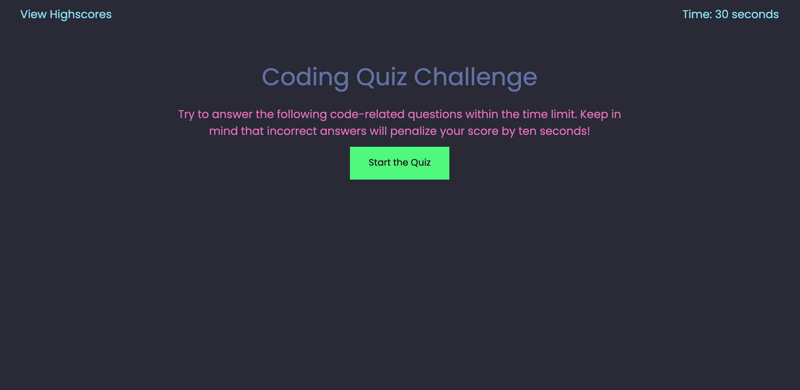

# Coding Quiz Challenge

## Description
The goal of this assignment was to buid a timed multiple-choice quiz using HTML, CSS, and JavaScript code. 

Provide a short description explaining the what, why, and how of your project. Use the following questions as a guide:

What was your motivation?
Why did you build this project? (Note: the answer is not "Because it was a homework assignment.")
What problem does it solve?
What did you learn?
What makes your project stand out?

Your README might also describe some of the challenges you faced, as well as the features you plan to implement in the future. And if your project is deployed, make sure to include a link to the deployed application so people can see it in action!

## Process
1. My first step was to identify what elements were needed: 
- a header with a link to view highscores (top left) and the countdown timer (top right)
- a container for the introductory content (quiz instructions) and start button
- a container where I could append the quiz content I would later dynamically create with JavaScript
2. Then, I began building out each element in my HTML file, setting up the initial structure of the application. 
3. I figured a majority of my time and effort would be spent on the JavaScript functions running the actual quiz, so I decided to temporarily add placeholder content so I could get the CSS styling out of the way. After creating sample questions and answers in my HTML, I used some simple CSS styling to get the elements looking how I wanted them to, and making sure to take note of the specific classes and IDs used to apply those styles.
4. Next, I moved to my JavaScript file where I dynamically created the elements I had just styled, and used the setAttribute method to apply the same classes and IDs used in CSS. After this step, I was officially done with styling and structure, so it was time to focus on my JavaSript!
5. First, I created an object that contained all of my questions, answer options, and correct answers. 
5. Then I began developing the timer countdown function, since this would need to immediately start when the user clicks the "Start the Quiz" button. After using the setInterval function to create the timer, I created an event listener that would call the timer function on click of the start button. 
6. Next, I created a function that would clear the introductory content (quiz instructions, start button, etc.) and append the dynamically created questions and answers to the actual page. I called this function inside of the timer function, since both of these events needed to happen at the same time and I had already created an event listener for the timer function.
7. 

## Usage
Link to deployed application: https://go-yasi.github.io/code-quiz/

Below is a screenshot of the live application: 

## Conclusion
I found this to be the most difficult assignment of the course so far. Even though I felt a lot more confident in my understanding of JavaScript, I still found myself stuck while coding the different functions needed to get this application up and running. That being said, it was realy exciting to see how far I'd come since last week 